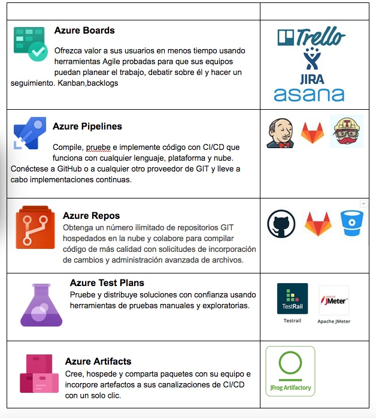
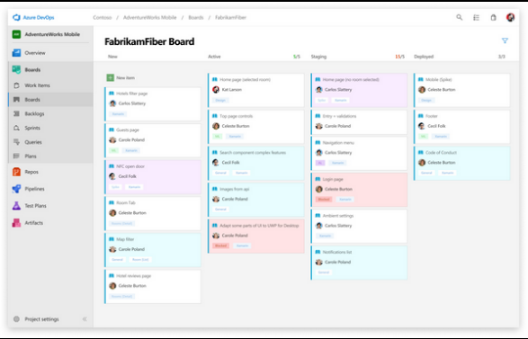

## Azure Devops  mucho más que CI / CD


 

### CONTEXTO

Como “hacer siempre lo mismo aburre” aprenderemos a utilizar un set de herramientas muy potente que si eres responsable de proyectos, Scrum master o un automatizador atrevido, seguramente te llame la atención y hasta te den ganas de implementarlo o proponerlo.
Se llama “ Azure Devops”, básicamente trata de un stack muy bien pensado que unifica conceptos y herramientas que generalmente utilizamos por separado.
Como acostumbro en mis videos os pondré una comparativa de un entorno CI / CD descentralizado que os puede resultar familiar y el stack “Azure Devos”.

Primero os presento los componentes que contiene esta solución.

COMPARATIVA PROPUESTA 


 


LABORATORIO
Pero partiremos de unos conceptos amigables que harán de este gran cambio y desconfinamiento un agradable paseo , porque si vieron mis videos de Jenkins lo que veremos hoy no les asustara en lo mas mínimo.


```
pipeline {       // Identificamos dónde comienza y donde termina nuestro pipeline

agent any       //  Especificamos en que nodos disponibles queremos ejecutarlo por ejemplo docker { image 'node:7-alpine' }

environment {   // configuración de variables de entorno 
}

stages{             // Bloque donde se definen una serie de estados a realizar dentro del pipeline.   

    stage('deploy') {  // Bloque que permite segmentar en tareas nuestro objetivo, si falla alguna el stage se mostrará en rojo 
      steps {       // Tareas a realizar 
        
        }          //  fin de steps
      }            //  fin de stage
    }              //  fin de stages
}                  //  fin de pipeline

```

### DOCUMENTACIÓN:  

- https://aex.dev.azure.com/me?mkt=es-ES                     (proyecto de prueba)
- https://azure.microsoft.com/es-es/services/devops/        ( documentacion general )
- https://marketplace.visualstudio.com/azuredevops         ( tienda de componentes para potenciar aure devops)
- https://docs.microsoft.com/es-es/azure/devops/pipelines/?view=azure-devops  ( index Microsoft pipeline)
- https://docs.microsoft.com/en-us/azure/devops/pipelines/process/variables?view=azure-devops&tabs=yaml%2Cbatch   ( Variables )
- https://docs.microsoft.com/en-us/azure/devops/pipelines/build/variables?view=azure-devops&tabs=yaml ( Variables predefinidas )

### OBJETIVOS  

- Realizar un pipeline utilizando un pipeline respetando la estructura tal cual lo hacíamos en Jenkins y para la primer toma de contacto.
- Realizar un pipeline de integración continua, que escuchara los cambios en las rama develop/master y guardaran los cambios en el repositorio.
- Realizar un pipeline de despliegue continua que generará el componente y lo desplegará de forma automática, sin ningún tipo de asistencia.
- Realizar un Pipeline con varios stages, que realice los siguientes pasos:
   - Clonar o detectar cambios  el repositorio y realizar un test para verificar el código.
   - Construir una imagen docker y subirla al docker registry. 
   - Realizar pull de dicha aplicación. 
   - Desplegarla en una instancia.

## Azure boards


 

