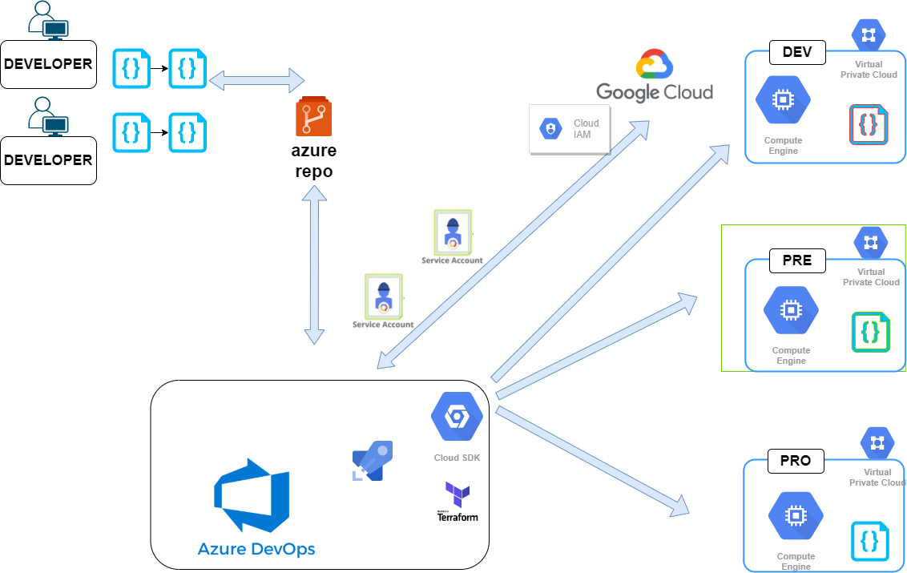
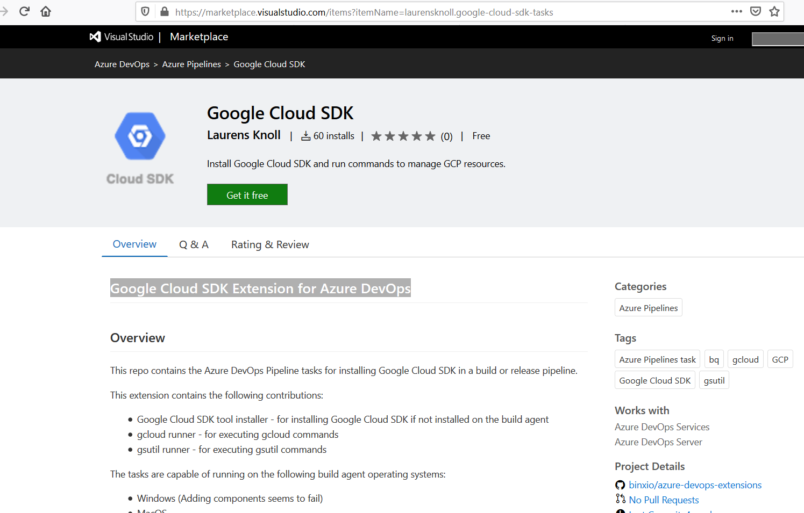
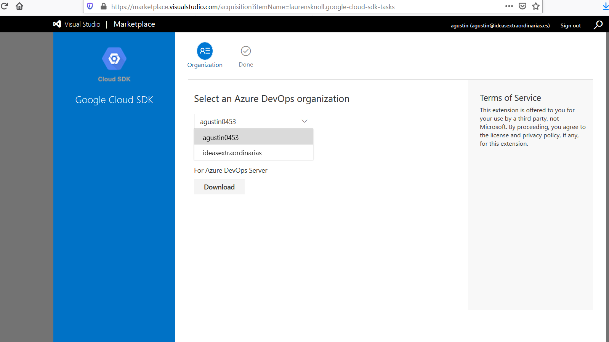

# Objetivo

Realizar la configurción necesaria en azure devops para podererealizar automatismos en la nube de Google Cloud.

### DOCUMENTACIÓN:  

- https://docs.microsoft.com/en-us/azure/devops/pipelines/process/variables?view=azure-devops&tabs=yaml%2Cbatch
- https://docs.microsoft.com/en-us/azure/devops/pipelines/tasks/utility/download-secure-file?view=azure-devops

En este video una buena práctica para poder conectarnos a nuestra respectiva nube y proyecto en la nube Google.
Tambien os contare una práctica que encontré configurada en el pasado  y no recomiendo por temas de seguridad, evaluaremos sus pros y contras




### Componentes necesarios 

- Cuenta en GCP ( free tier) o con saldo suficiente para hacer estas pruebas
- 2 cuentas de servicio 
  - service-account-total-azure             Owner        Full access to all resources.
  - service-account-pub-sub-azure                    Viewer        access to pub sub.
- Cuenta en Azure devops y conceptos de pipelines
- Extensión "Google Cloud SDK Extension for Azure DevOps"
- Código de Pipeline declarativo


#### Cómo creamos una cuenta de servicio

- https://cloud.google.com/iam/docs/creating-managing-service-accounts?hl=es

¿Qué son las cuentas de servicio?
Una cuenta de servicio es un tipo especial de cuenta que usa una aplicación o una instancia de máquina virtual (VM), no una persona. Las aplicaciones usan cuentas de servicio para realizar llamadas a la API autorizadas.

1. Entramos al panel web de GCP
2. Luego accedemos por el menú superior hasta IAM & admin
3. Service Accounts
4. Presionamos boton superior de "+ CREATE SERVICE ACCOUNT" Asignamos permisos similares a estos 


### Extensión "Google Cloud SDK Extension for Azure DevOps"

Extensión de Azure devops:  Nos permite ampliar las funcionalidades de la herramienta CI /CD y en este caso nos permitira contar con el cliente SDK de google en los agentes donde se ejecutaran los automatismos.

- https://marketplace.visualstudio.com/items?itemName=laurensknoll.google-cloud-sdk-tasks





###  Comandos que utilizaremos una vez conectados a la nube


```
  gcloud projects list
  gcloud compute instance-groups list-instances
  gcloud app instances list
  gcloud bigtable instances list
  gcloud compute instances list
  gcloud filestore instances list
  gcloud redis instances list
  gcloud spanner instances list
  gcloud sql instances list
  gcloud compute instance-groups list

```
### configuración de service account en Azure Devops

Siguiendo los siguientes pasos configuraremos de forma segura los credenciales de Google Cloud llamadas "service account" con las que nos conectaremos al projecto en la nube. 

1. Obtenemos nuestro fichero del service account  "service-account-total-control-azure.yml"
2. Dentro de Azure Devops vamos a Pipelines/Library/Secure files/
3. Subimos el fichero "service-account-total-control-azure.yml, permitimos que sea usado por todos los pipelines.


### Pipeline que usaremos 

#### Service account service-account-total-control
```
trigger: none

pool: 
  vmImage: 'ubuntu-latest'

variables:
        GOOGLE_PROJECT_ID: "ivory-honor-272915" 
        GOOGLE_PROJECT_NAME: "Proyecto-ideas-extraordinarias"
        GOOGLE_APPLICATION_CREDENTIALS: '$(service_account_total_azure.secureFilePath)'
        GOOGLE_CLOUD_KEYFILE_JSON: '$(service_account_total_azure.secureFilePath)'

stages:
  - stage: "GCP_Connection"
    displayName: "Connection to Google Cloud Project"
    jobs:
      - job: "Configure_Service_Account"
        displayName: "Configure Service Account"
        steps:
          - task: DownloadSecureFile@1
            name: 'service_account_total_azure'
            displayName: 'Download service account'
            inputs:
              secureFile: 'service-account-total-azure.json'
          - bash: 'echo $GOOGLE_PROJECT_ID'
          - bash: 'gcloud --version'
            name:  "version"
          - bash: 'gcloud auth activate-service-account --key-file=$GOOGLE_APPLICATION_CREDENTIALS'
            name: "Active_Service"
          - bash: 'gcloud config set project $GOOGLE_PROJECT_ID'
          - bash: 'gcloud config list'
          - bash: 'gcloud projects list'
          - bash: 'gcloud compute networks list'

```

#### Service account pub sub
```
trigger: none

pool: 
  vmImage: 'ubuntu-latest'

variables:
        GOOGLE_PROJECT_ID: "ivory-honor-272915" 
        GOOGLE_PROJECT_NAME: "Proyecto-ideas-extraordinarias"
        GOOGLE_APPLICATION_CREDENTIALS: '$(service_account_pubsub_azure.secureFilePath)'
        GOOGLE_CLOUD_KEYFILE_JSON: '$(service_account_pubsub_azure.secureFilePath)'

stages:
  - stage: "GCP_Connection"
    displayName: "Connection to Google Cloud Project"
    jobs:
      - job: "Configure_Service_Account"
        displayName: "Configure Service Account"
        steps:
          - task: DownloadSecureFile@1
            name: 'service_account_pubsub_azure'
            displayName: 'Download service account'
            inputs:
              secureFile: 'service-account-pub-sub-azure.json'
          - bash: 'echo $GOOGLE_PROJECT_ID'
          - bash: 'gcloud --version'
            name:  "version"
          - bash: 'gcloud auth activate-service-account --key-file=$GOOGLE_APPLICATION_CREDENTIALS'
            name: "Active_Service"
          - bash: 'gcloud config set project $GOOGLE_PROJECT_ID'
          - bash: 'gcloud pubsub topics list'
          - bash: 'gcloud projects list'
          - bash: 'gcloud compute networks list'
```