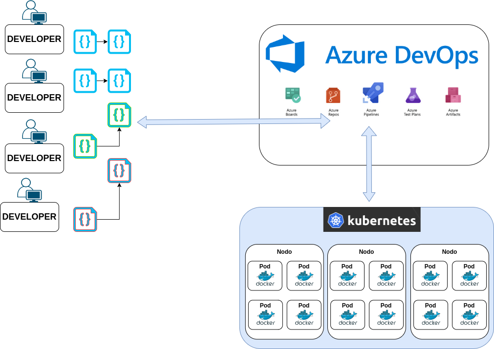
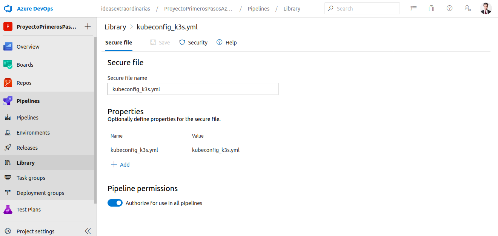
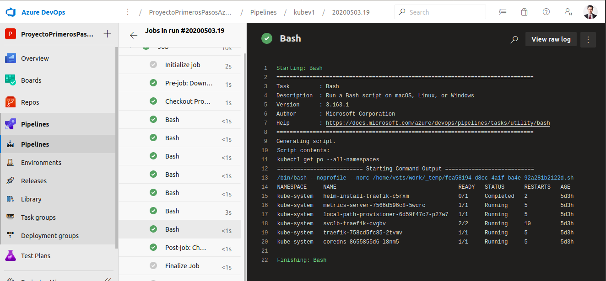

## Conexión de Azure Devops con Kubernetes

### Objetivo

Realizaremos la conexión de Azure Devops con Kubernetes siguiendo los siguientes pasos




1. Obtenemos nuestro fichero de conexion "kubeconfig.yml"
2. Dentro de Azure Devops vamos a Pipelines/Library/Secure files/
3. Subimos el fichero "kubeconfig.yml, permitimos que sea usado por todos los pipelines.




4. Creamos un fichero con el pipeline con el siguiente código con el nombre "pipeline_connect_kubernetes.yml" y guardamos los cambios.


```
trigger: none

pool: 
  vmImage: 'ubuntu-latest'
  
steps:

  - task: DownloadSecureFile@1
    displayName: Download secure file kubeconfig_k3s
    name: kubeconfig_k3s
    inputs:
      secureFile: 'kubeconfig_k3s.yml'
  - bash: echo "Antes de comenzar"
  - bash: mkdir ~/.kube
  - bash: cat $KUBECONFIG_K3S_SECUREFILEPATH >  ~/.kube/config
  - bash: env
  - bash: kubectl cluster-info
  - bash: kubectl get po --all-namespaces
```

5. Subimos los cambios al repositorio.
6. Creamos el automatismo desde Azure Pipeline como explicamos en el primer video.
7. Ejecutamos el automatismo  y confirmamos que nos retorna información del cluster y listado de pods.


